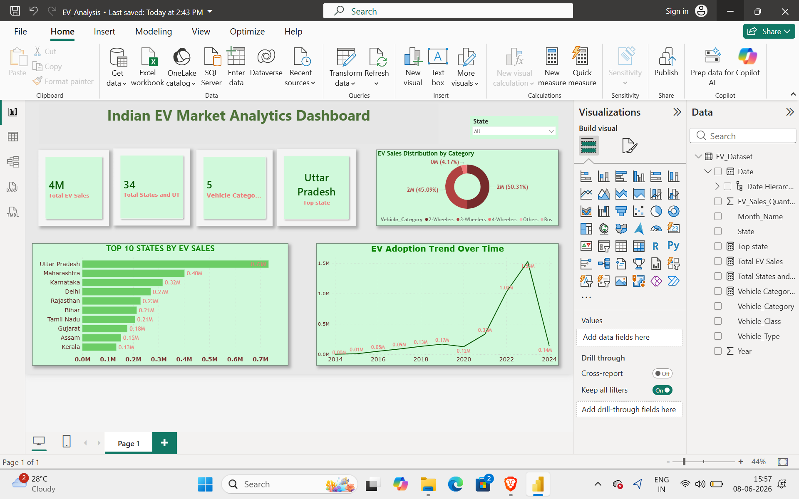

# Indian EV Market Analytics Dashboard

## Overview
This Power BI project analyzes Electric Vehicle (EV) adoption trends across India using interactive dashboards and business intelligence techniques.

## Dashboard Preview

## Key Metrics

- Total EV Sales: 4M+
- States & Union Territories Covered: 34
- Vehicle Categories: 5
- Top Performing State: Uttar Pradesh

## Key Insights

- Uttar Pradesh recorded the highest EV sales.
- Maharashtra and Karnataka are among the leading EV adoption states.
- EV adoption accelerated significantly after 2021.
- 2-Wheelers dominate the Indian EV market.
- Strong year-over-year growth indicates increasing EV acceptance.

## Tools Used

- Power BI
- CSV Dataset
- Data Visualization
- Business Intelligence
- Dashboard Design

---

## Files

 File - Description 
 EV_Analysis.pbix - Power BI Dashboard 
 EV_Dataset.csv - Source Dataset 

---

## Skills Demonstrated

- Data Cleaning
- Data Visualization
- KPI Development
- Dashboard Design
- Trend Analysis
- Business Intelligence

## Author

Deepthi Das
